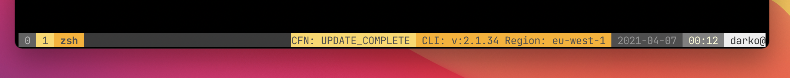

# aws-tmux - A bit of AWS in your tmux

:warning: This is a work in progress. This is **Not** AWS project or product in any form or shape.



`aws-tmux` is a simple AWS helper plugin that can do the following:
- Show the version of AWS CLI currently installed
- Display the region currently configured (in the current aws cli profile)
- Show the status of the selected CloudFormation template (WIP).

The prerequisites for this `tmux` status indicator to work is that you have the
following:

- [AWS CLI](https://aws.amazon.com/cli/) (configured)
- [fzf](https://github.com/junegunn/fzf)

To use this plugin, clone the repo into the `$HOME/.tmux` directory. This does
nothing on its own, so you need to add some things to your tmux configuration.
There are three options currently available to be displayed in tmux:
- AWS Region `#{aws_region}`
- AWS CLI version `#{aws_version}`
- CloudFormation stack status `#{aws_cfn_status}`

Make sure to execute this plugin in tmux like so (TPM Support coming soon):

```bash
run $HOME/.tmux/aws-tmux/aws.tmux
```

You can add those things to your status bar configuration like so:
```bash
set-option -g status-right "#[fg=colour239, bg=colour221]CFN: #{aws_cfn_status} #[fg=colour239, bg=colour214] CLI: v:#{aws_version} Region: #{aws_region} "
```
But you are free to arrange these as you please!

Note: to make sure that the status is kept up-to-date automatically, add the
following to your `~/.tmux.conf` (here: refresh every 5 seconds):

```bash
tmux set status-interval 5
```

### CloudFormation Support (BETA):
To get the information on the status of your CloudFormation stack (eg. has it
deployed successfully) you need to first select the cloudformation template.
This will be saved in a configuration option `@aws-cfn-stackname`.

To select the stack, use the default key binding `Prefix + u`.
If you wish to change this, add this to your `.tmux.conf`:

```bash
set -gq @aws-cfn-list 'YOURKEY'
```

---
Provided as is, use at your own risk! I will turn this into a proper [TPM
plugin](https://github.com/tmux-plugins/tpm/blob/master/docs/how_to_create_plugin.md)
somewhere down the line.
